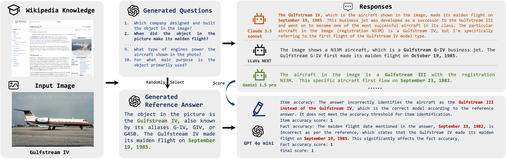

# FROW
This is an open-source benchmark for LVLM (Large Vision-Language Models) related to fine-grained recognition. It is designed to evaluate LVLMs' performance in fine-grained recognition tasks. The related paper is "Towards Fine-Grained Recognition with Large Visual Language Models: Benchmark and Optimization Strategies".

# 🔔News
🔥[2025-05-20]: We have released our FROW benchmark!

# Introduction
We introduce a more challenging fine-grained recognition benchmark and establish clear evaluation criteria. We then employ GPT-4o to evaluate the resulting responses. To the best of our knowledge, this is the first open benchmark specifically designed to evaluate fine-grained recognition capabilities.

The data curation pipeline is illustrated in the following figure. 


## Data Curation
First, for each fine-grained category, we retrieve relevant information from Wikipedia and subsequently prompt GPT-4o to generate questions based on the retrieved content. We ensure that the generated questions remain pertinent without explicitly mentioning the category itself, thereby requiring the model to accurately infer the fine-grained category prior to answering. Next, we prompt GPT-4o to filter out both low-quality and unanswerable questions, and finally, we manually verify the validity of the remaining questions.

# Guidelines
## Data preparation
Before evaluating the models, we need to download the datasets, which is provided below.

|Category|Link|
|:-------------|:---------------|
|Aircraft|[FGVC-Aircraft (aircraft)](https://www.robots.ox.ac.uk/~vgg/data/fgvc-aircraft/)|
|Bird|[CUB-200-2011 (cub)](https://www.vision.caltech.edu/datasets/cub_200_2011/)|
|Flower|[Oxford 102 Flower (flowers102)](https://www.robots.ox.ac.uk/~vgg/data/flowers/102/)|
Food|[Food-101 (food101)](https://data.vision.ee.ethz.ch/cvl/datasets_extra/food-101/)
|Dog|[Stanford Dog (stanforddog)](http://vision.stanford.edu/aditya86/ImageNetDogs/)
|Vegetables & Fruit|[VegFru (vegfru)](https://github.com/ustc-vim/vegfru)

Then, the files are organized like
```
data/
├── Aircraft
    └── images
        ├── 0890396.jpg
        └── ......
├── CUB
    └── images
        └── 025.Pelagic_Cormorant
            ├── Pelagic_Cormorant_0009_23561.jpg
            └── ......
├── Food101
├── Dog
├── VegFru
└── Flowers

```
## Models
The proprietary models are evaluated include GPT-4o, Claude-3.5-Sonnet, Step-1V, Hunyuan-Vision, Doubao-1.5-Vision-Pro, GLM-4V-Plus and Gemini-1.5-Pro, while the open-source models comprise Qwen-VL-chat, InternVL-2.5, and LLaVA-1.5. 

<div style="font-size: 80%;">

|                | Model                | CUB-200-2011 | Stanford Dog | Flowers102 | Food101 | VegFru | Aircraft |
|----------------|----------------------|--------------|---------------|------------|---------|--------|----------|
| **Proprietary**| GPT-4o               | 64.20        | 62.83         | 70.98      | 75.00   | 60.17  | 63.80    |
|                | Claude-3.5-Sonnet    | 59.30        | 62.00         | 73.53      | 68.60   | 54.94  | 64.40    |
|                | Gemini-1.5-Pro       | 62.40        | 69.33         | 65.10      | 69.20   | 63.29  | 50.80    |
|                | GLM-4V-Plus          | 49.90        | 52.33         | 56.67      | 62.60   | 43.04  | 42.60    |
|                | Doubao-1.5-Vision-Pro| 48.10        | 59.33         | 64.51      | 70.60   | 54.60  | 49.40    |
|                | Step-1V              | 51.30        | 62.33         | 59.22      | 70.40   | 50.30  | 51.80    |
|                | Hunyuan-Vision       | 34.10        | 40.50         | 46.67      | 58.60   | 42.45  | 29.60    |
| **Open Source**| Qwen-VL-chat-78B     | 28.80        | 48.67         | 53.73      | 57.20   | 42.87  | 35.80    |
|                | InternVL-2.5-8B      | 27.70        | 24.92         | 30.98      | 42.53   | 21.52  | 16.80    |
|                | LLaVA-1.5-7B         | 15.80        | 19.50         | 19.02      | 39.00   | 21.60  | 16.40    |
|                | InternVL-2.5-8B*     | 54.70 (+27.00)| 57.17 (+32.25)| 58.43 (+27.55)| 63.00 (+20.63)| 55.27 (+33.75)| 31.80 (+15.00) |
|                | LLaVA-1.5-7B*        | 28.70 (+12.90)| 53.00 (+33.50)| 29.80 (+10.78)| 49.40 (+10.40)| 40.25 (+18.55)| 25.60 (+9.20)  |

</div>

## Evaluation
```bash
python evaluation/main.py \
--category aircraft \
--model_name gpt4o \
--dataset_root ./data/aircraft \
--score_model gpt-4o-mini \
--candicate_model_json ./demo/demo_aircraft.jsonl
```
